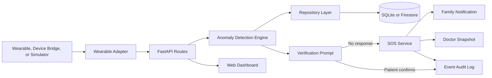
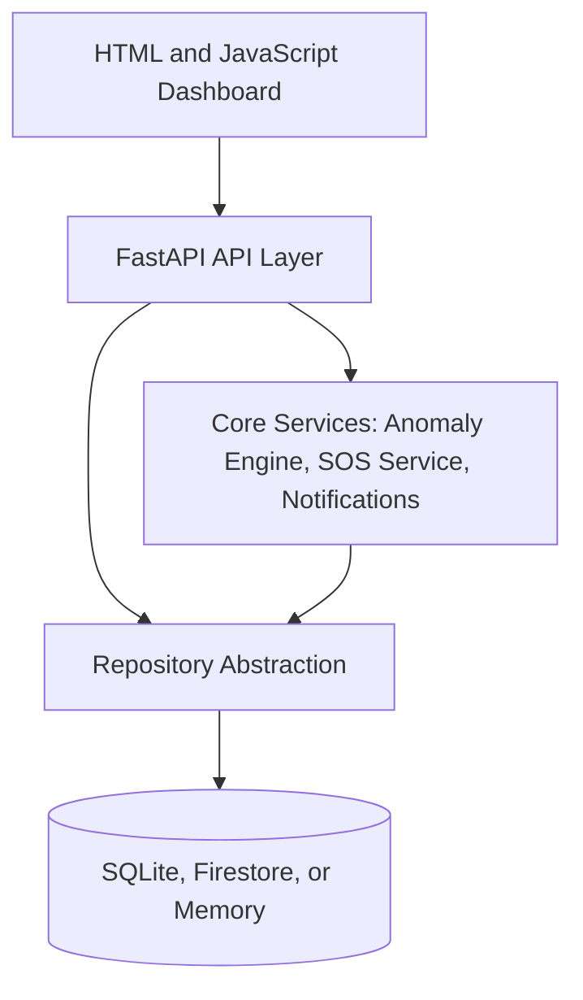
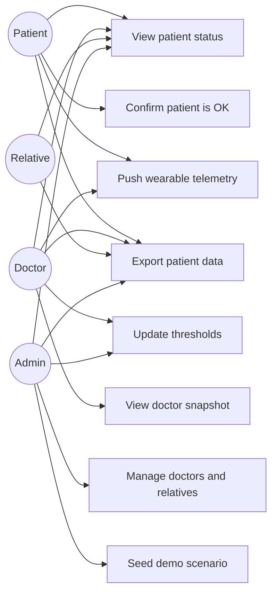
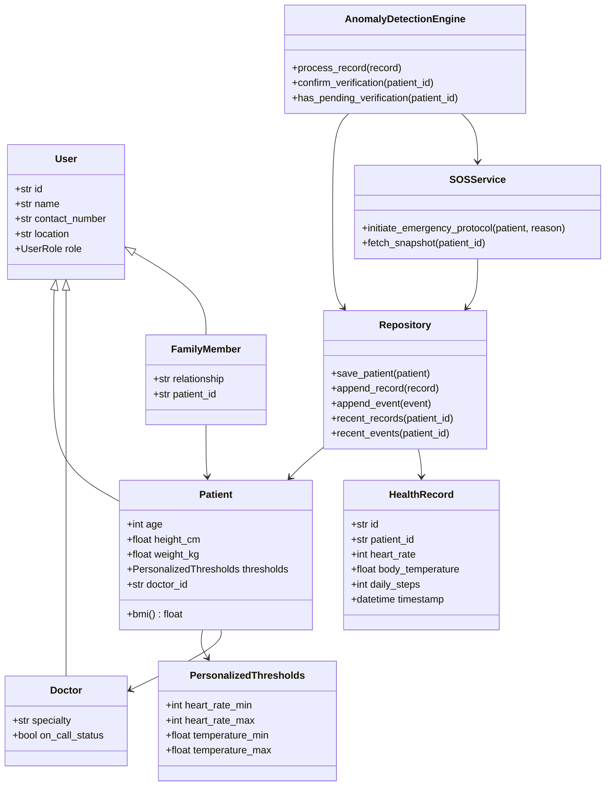
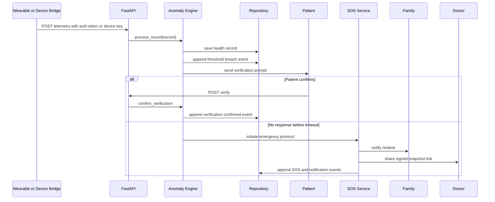

# Midterm Deliverables Guide

This file maps the Fundamentals of Software Engineering midterm assignment to
the current VitalSense project. It is meant to be copied into the final report
and presentation, then refined with screenshots and exported to PDF/PPTX.

## Status Checklist

| Requirement | Status | Notes |
|---|---|---|
| 1.1 Project charter and vision | Ready draft below | Review wording as a team before PDF export. |
| 1.2 Personas, scenarios, user stories, feature list | Ready draft below | Add Jira issue IDs if available. |
| 1.3 Architecture diagrams | Ready Mermaid drafts below | Export as high-resolution images for the report. |
| 1.4 UML use case, class, sequence diagrams | Ready Mermaid drafts below | Export as images and verify readability. |
| 1.5 Selected design pattern | Ready draft below | Adapter pattern matches implemented code. |
| 1.6 GitHub repository and README | Mostly ready | Add repository screenshots and commit/branch screenshots. |
| 1.7 Jira backlog and sprint screenshots | Missing manual asset | Needs clear screenshots from Jira. |
| Presentation slides | Outline ready below | Must be converted to PPTX/PDF and split across team members. |

## 1.1 Project Charter And Vision

**Project name:** VitalSense

**Purpose:** VitalSense turns passive wearable health readings into active
patient protection by detecting abnormal vitals, asking the patient to verify
their condition, and escalating to family members and doctors when there is no
response.

**Problem statement:** Elderly and at-risk patients may experience sudden
health deterioration while alone. Wearables can collect useful data, but raw
measurements are not enough if nobody reacts quickly. VitalSense closes that
gap by connecting telemetry, patient verification, family notification, and
doctor handoff in one workflow.

**Scope:**

- Patient, doctor, and relative role logins.
- Patient registration and profile management.
- Doctor and family contact management.
- Personalized heart-rate and temperature thresholds.
- Simulated and device-key wearable telemetry ingestion.
- Threshold breach detection and notification-based verification prompt.
- SOS escalation with event audit trail and tokenized doctor snapshot link.
- SQLite persistence, optional Firestore backend, and JSON patient export.

**Out of scope for the midterm prototype:**

- Certified clinical diagnosis.
- Real production wearable SDK authorization flows beyond the device bridge.
- Real emergency dispatch integration.
- Full hospital EHR integration.

**Stakeholders:**

- Patients who need monitoring.
- Family or relatives who receive escalation alerts.
- Doctors who need concise snapshots during an emergency.
- System administrators who manage profiles and demo data.
- Development team and course evaluators.

**Constraints:**

- Prototype must be demonstrable in class within limited time.
- Must work without paid external services.
- Health logic must be explainable and testable.
- Privacy-sensitive patient data must be role-scoped.

**Vision statement:** VitalSense provides active health protection for at-risk
patients by combining wearable telemetry, personalized thresholds, verification
prompts, and rapid emergency escalation into a clear web dashboard.

## 1.2 Personas, Scenarios, User Stories, Feature List

### Persona 1 - Ahmet Yilmaz, Patient

Ahmet is a 67-year-old patient with cardiac risk. He lives independently and
wears a health device. He wants his vitals monitored without manually checking
an app all day.

**Scenario:** Ahmet's heart rate spikes above his personalized threshold.
VitalSense sends a verification prompt. If Ahmet confirms he is OK, the system
cancels escalation. If he does not respond, VitalSense notifies family and
shares a doctor snapshot.

### Persona 2 - Dr. Elif Demir, Doctor

Dr. Demir is a cardiologist monitoring several patients. She needs a concise
health snapshot during escalation rather than raw scattered readings.

**Scenario:** An SOS is triggered for Ahmet. Dr. Demir opens the dashboard,
reviews recent vitals, events, thresholds, and patient context, then decides
the next action.

### Persona 3 - Mina Yilmaz, Relative

Mina is Ahmet's daughter. She is not a clinician, but she needs timely alerts
when Ahmet may need help.

**Scenario:** Mina logs in with a relative account and sees Ahmet's read-only
status. During an SOS, she can understand the current risk state and recent
events without changing clinical configuration.

### Persona 4 - System Administrator

The admin prepares demo data and manages patients, doctors, relatives, and
thresholds for the prototype.

**Scenario:** Before a demo, the admin seeds the demo scenario, assigns a
doctor, links relatives, and starts telemetry simulation.

### User Stories

| Priority | User Story |
|---|---|
| Must | As a patient, I want my vitals monitored against personalized thresholds so that risky readings can be detected quickly. |
| Must | As a patient, I want to confirm that I am OK after a warning so that false alarms do not escalate unnecessarily. |
| Must | As a doctor, I want to see a recent health snapshot so that I can understand the patient's condition quickly. |
| Must | As a relative, I want read-only access to my family member's status so that I can follow emergencies without changing data. |
| Must | As an admin, I want to register patients, doctors, and family contacts so that the monitoring network can be configured. |
| Should | As a doctor, I want to tune thresholds for assigned patients so that monitoring is personalized. |
| Should | As an admin, I want a demo seed workflow so that classroom demonstration is repeatable. |
| Should | As an authorized user, I want to export patient data so that records can be reviewed outside the dashboard. |
| Could | As a developer, I want multiple persistence backends so that the project runs locally and can later integrate with cloud storage. |

### Prioritized Feature List

1. Role-based authentication for admin, patient, doctor, and relative.
2. Patient, doctor, and family CRUD workflows.
3. Wearable telemetry ingestion through adapter-compatible data and device-key API bridge.
4. Personalized thresholds and anomaly detection.
5. Patient verification flow through dashboard and notification service.
6. SOS escalation and notification audit trail.
7. Tokenized doctor snapshot view.
8. SQLite database persistence and optional Firestore.
9. Patient data export.
10. Demo scripts and test coverage.

## 1.3 Architecture Diagrams

### Hybrid Layered And Event-Driven Architecture



### Layered View



## 1.4 UML Diagrams

### Use Case Diagram



### Class Diagram



### Sequence Diagram - Threshold Breach And SOS



## 1.5 Selected Design Pattern

**Pattern:** Adapter

VitalSense uses the Adapter pattern to normalize different wearable APIs behind
one `StandardWearable` interface. Apple, Samsung, and simulated watches expose
different method names and payload formats, but the anomaly engine only needs
`get_heart_rate()`, `get_temperature()`, and `get_steps()`.

**Why this pattern fits:** It keeps vendor-specific code outside the health
logic. A new device can be added by creating a new adapter class without
changing the anomaly engine or SOS workflow.

**Implemented files:**

- `app/adapters/base.py`
- `app/adapters/apple.py`
- `app/adapters/samsung.py`
- `app/adapters/simulated.py`
- `tests/test_adapters.py`

```python
class StandardWearable(Protocol):
    device_name: str

    def get_heart_rate(self) -> int: ...
    def get_temperature(self) -> float: ...
    def get_steps(self) -> int: ...
```

## 1.6 GitHub Repository

Use these in the report:

- Repository URL: `https://github.com/seros-cimenstein/VitalSense`
- Dev deployment: `https://suzuki-carry-vitalsense-dev.hf.space`
- Main README: `README.md`
- Architecture mapping: `docs/ARCHITECTURE.md`
- Demo tooling: `docs/DEMO_TOOLS.md`
- Test command: `python -m pytest -q`

Screenshots still needed:

- GitHub repository root.
- Folder structure.
- Commit history showing team progress.
- Branch list or branching strategy.
- Running dashboard screenshot.

## 1.7 Jira Project Management

This cannot be completed from the repo alone. The final report must include
clear screenshots from Jira:

- Product backlog with all user stories.
- Prioritized backlog ordering.
- Sprint planning board with at least one sprint.
- Stories assigned to the sprint.

Recommended Jira story names:

- Register patient profile
- Register doctor profile
- Link relative to patient
- Ingest wearable telemetry
- Detect threshold breach
- Ask patient for verification
- Trigger SOS after timeout
- Notify relatives
- Generate doctor snapshot
- Add role-based login
- Persist data in database
- Export patient data

## Presentation Outline

Target: 10 minutes maximum, all members speak.

1. **Project Introduction**
   - VitalSense name, goal, team members.
   - One-sentence problem and value.

2. **Charter And Vision**
   - Scope, stakeholders, constraints.
   - What is in and out of scope.

3. **Personas And User Stories**
   - Patient, doctor, relative, admin.
   - Top three user stories.

4. **Architecture**
   - Show the hybrid layered/event-driven diagram.
   - Explain telemetry to SOS flow.

5. **UML Diagrams**
   - Use case diagram.
   - Class diagram.
   - Sequence diagram for breach to SOS.

6. **Design Pattern**
   - Adapter pattern.
   - Show StandardWearable and one adapter example.

7. **GitHub And Jira**
   - Repository structure and commit history.
   - Jira backlog and sprint screenshots.

8. **Demo And Current Implementation**
   - Role logins.
   - Patient dashboard.
  - Device bridge telemetry spike and verification/SOS.
  - Tokenized doctor snapshot link.
  - SQLite persistence and export.

9. **Conclusion And Next Steps**
   - Production wearable SDK authorization.
   - Persistent hosted database volume.
   - Better notification channels.
   - Clinical review and privacy hardening.

## Remaining Work Before Submission

1. Export Mermaid diagrams as high-resolution images and place them in the
   report instead of relying only on Markdown.
2. Create the final report PDF with the required filename:
   `TeamVital_MidtermReport.pdf`.
3. Create presentation slides and export as:
   `TeamVital_MidtermPresentation.pptx` or `.pdf`.
4. Capture and annotate Jira screenshots.
5. Capture GitHub screenshots.
6. Assign slide speaking parts to all team members.
7. Do one timed 10-minute rehearsal.
